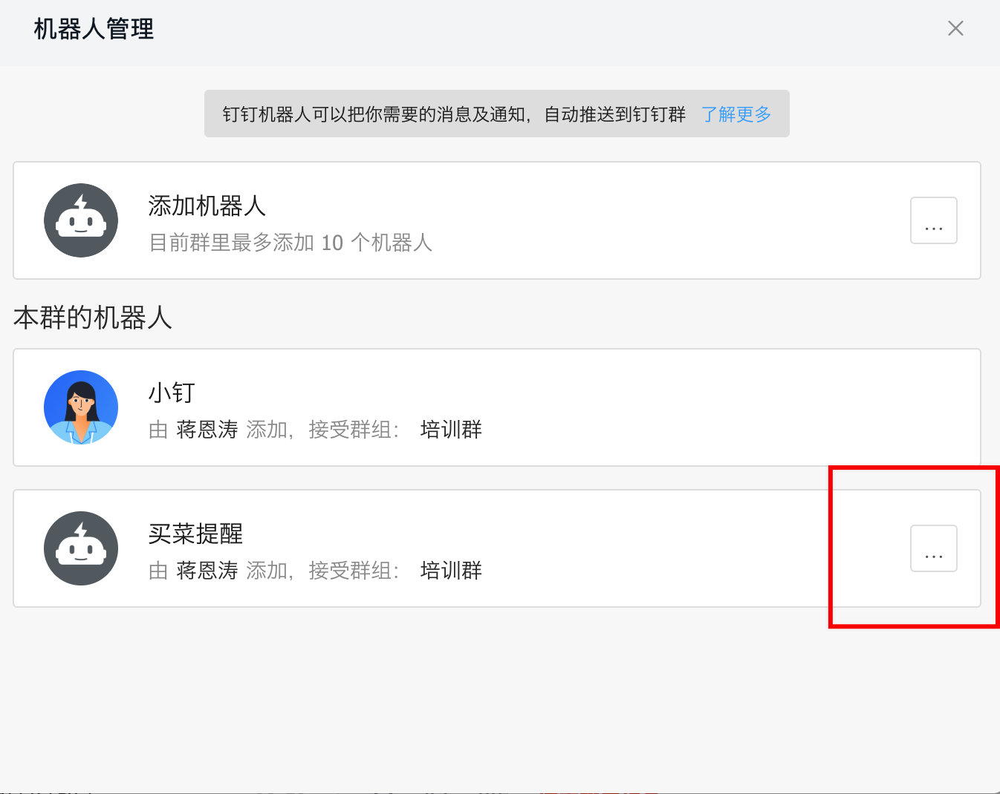

# 前言
本文尽量通俗易懂足够详细，让不会技术的同学也能实现大上海抢菜梦~但是抓包步骤实在是有点不知道从何讲起，而且我试了下iOS国区App Store能下载到的抓包软件（Stream、HTTP Catcher以及Thor）都抓不到我们需要的链接，我是用Quantumult X（这个软件只有美区App Store才能下载）抓到的，所以这一块我放几个参考链接大家自己研究下。安卓方面我手上也没有安卓手机，所以也验证不了。如果有其他疑问大家可以随时联系我，我尽量帮大家解决。

脚本功能很简单，监控所在站点是否有运力配送，然后通过钉钉机器人发送消息，并不能直接下单~

# 软件准备

## VS Code 及 Code Runner 插件
首先通过此链接下载 [VS Code](https://code.visualstudio.com/download) 软件

然后在VS Code插件市场里搜索并下载Code Runner插件

 

## Node
通过此链接下载[Node](https://nodejs.org/zh-cn/download/)软件

参考链接：
https://blog.csdn.net/Small_Yogurt/article/details/104968169
https://blog.csdn.net/u014028317/article/details/106065573

# 下载并打开源码
1.点击【Code】-【Download Zip】下载完成并解压
 

2.VS Code左上角【File】-【Open Folder...】选择第一步解压出来的文件
 

# 安装依赖
1.VS Code左上角【Terminal】-【New Terminal】- 输入`npm install` - 回车
 

# 抓包
Charles（Mac & Windows）
https://www.charlesproxy.com/download/
https://www.bilibili.com/video/BV1L34y1q7XA

Fiddler（Mac & Windows）
https://www.telerik.com/download/fiddler
https://www.bilibili.com/video/BV1WD4y1U7Pe

Quantumult X（iOS）
https://www.youtube.com/watch?v=ucbpG_W_MvI

开启抓包软件，到叮咚买菜首页及购物车多刷新几次，然后点击【去结算】，点击【立即支付】呼起选择送达时间框，这个过程中APP会请求`https://maicai.api.ddxq.mobi/order/getMultiReserveTime`这个地址去查询站点的运力情况，抓到的参数很杂，这里先抓到备用，我也没有去验证哪些参数是必须的，所以大家到时候尽量都填上。

# 处理抓到的数据
下面是我用Quantumult X抓取到的请求头以及请求体的数据：
 
上图是请求头数据，将请求头里的字段一一对应复制到index.js文件中15行至48行之间的headers字段里。

 
上图是请求体数据，将请求体完整复制到indiex.js文件中第49行data字段里。

# 钉钉机器人通知
1.手机钉钉右上角【发起群聊】-【班级群】-【培训群】

2.电脑端点击刚刚创建的群聊-右上角设置-【智能群助手】-【添加机器人】
 

3.选择【自定义】-【添加】-勾选【加签】-【完成】
 
 

4.点击刚刚创建的机器人
 
 
将上图中的Webhook地址复制到index.js文件中第7行webhook字段中，将【秘钥】复制到index.js文件中第8行的secret字段中。

# 运行及停止代码
打开index.js文件，点击右上角小三角运行代码，如果output输出当前时间且钉钉群聊里的机器人发送【机器人测试提醒】说明脚本运行成功，点击小三角右边的正方形则停止运行代码。
 
 

